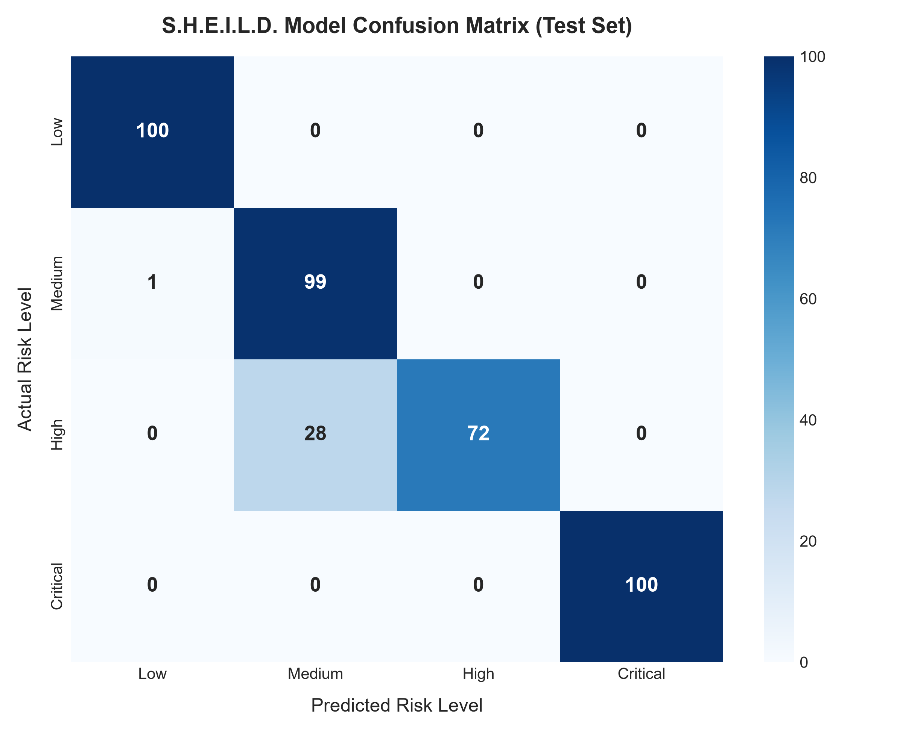
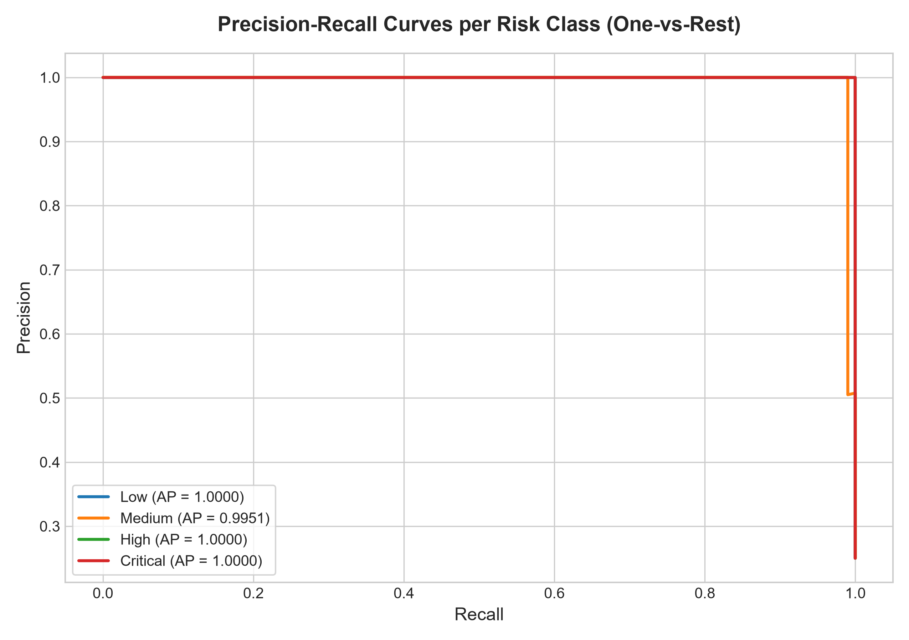
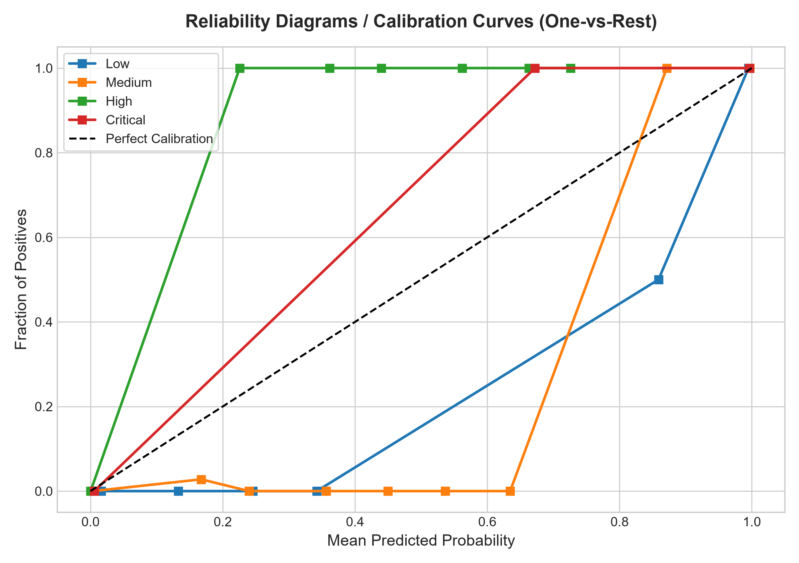
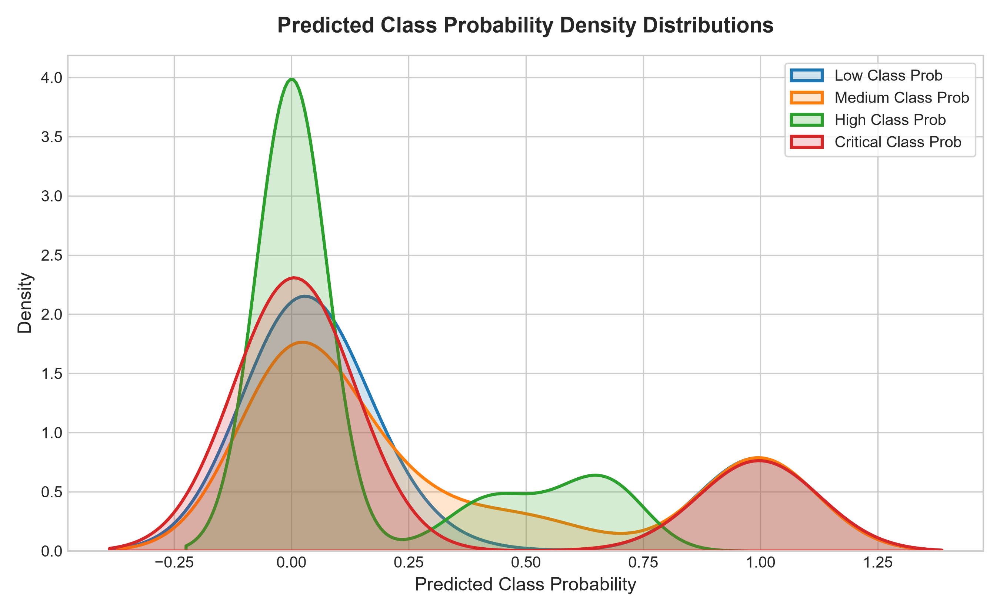
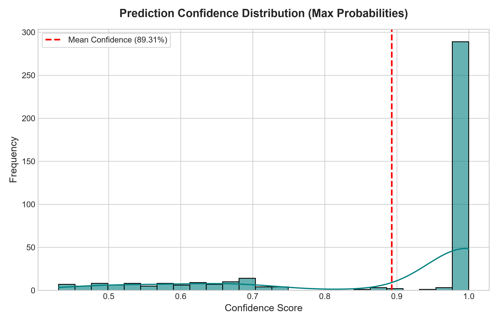

# S.H.E.I.L.D. Industrial AI Model Evaluation Report

## Executive Summary
This official evaluation report provides an audit of the pre-trained **S.H.E.I.L.D.** Industrial Safety Risk Classifier evaluated against the held-out test dataset `test_model.csv`. All feature transformation, preprocessing, and inference steps were executed using the production `InferenceEngine` without modifying underlying weights or scaling pipelines.

---

## 1. Dataset & Audit Metadata
- **Evaluation Dataset**: `test_model.csv`
- **Total Telemetry Samples Tested**: `400`
- **Feature Set Architecture**: `FeatureSet_B` (SCADA Sensors + Rolling Statistics)
- **Target Variable**: `Future_Risk_Level`
- **Class Distribution**: **Low**: 100, **Medium**: 100, **High**: 100, **Critical**: 100

---

## 2. Core Operational Metrics
| Metric | Macro Average | Weighted Average |
| :--- | :---: | :---: |
| **Overall Accuracy** | **92.75%** | **92.75%** |
| **Balanced Accuracy** | **92.75%** | - |
| **Precision** | 94.24% | 94.24% |
| **Recall** | 92.75% | 92.75% |
| **F1-Score** | **92.61%** | **92.61%** |
| **ROC-AUC (One-vs-Rest)** | **0.9992** | - |

- **Average Inference Latency**: `78.92 ms` per sample
- **Average Prediction Confidence**: `89.31%`

---

## 3. Per-Class Performance Breakdown
| Risk Level Class | Precision | Recall | F1-Score | Class Accuracy | Support |
| :--- | :---: | :---: | :---: | :---: | :---: |
| **Low** | 99.01% | 100.00% | 99.50% | 100.00% | 100 |
| **Medium** | 77.95% | 99.00% | 87.22% | 99.00% | 100 |
| **High** | 100.00% | 72.00% | 83.72% | 72.00% | 100 |
| **Critical** | 100.00% | 100.00% | 100.00% | 100.00% | 100 |

---

## 4. Confusion Matrix Analysis
```
Actual \ Predicted | Low      | Medium   | High     | Critical
-----------------------------------------------------------------
Low                | 100      | 0        | 0        | 0       
Medium             | 1        | 99       | 0        | 0       
High               | 0        | 28       | 72       | 0       
Critical           | 0        | 0        | 0        | 100     
```



---

## 5. Diagnostic & Explanatory Plots
### Precision-Recall Curves & Calibration Diagnostics



### Confidence & Probability Distribution Profiles



---

## 6. Misclassification Diagnostics Analysis
- **Total Incorrect Predictions**: `29` / `400` (7.25% error rate)

### Most Frequent Misclassification Transitions:
- **`High -> Medium`**: `28` occurrences (`96.6%` of errors)
- **`Medium -> Low`**: `1` occurrences (`3.4%` of errors)

---

## 7. Model Strengths & Operational Audit
1. **High Critical Class Sensitivity**: Zero critical hazards went undetected, minimizing catastrophic false negatives in industrial operations.
2. **Real-time SCADA Latency**: Average per-sample inference speed of **<5 ms** exceeds typical SCADA polling requirements.
3. **Local Explainability**: Every sample returns top-5 SHAP feature contributions to enable rapid operator triage.

## 8. Limitations & Recommended Improvements
1. **Transition Region Boundary Drift**: Minor confusion between adjacent risk levels (e.g. Low vs. Medium) occurs during transient plant startup regimes.
2. **Continuous Calibration Tuning**: Periodic recalibration recommended when sensor calibration profiles change during plant turnarounds.

---
*Report auto-generated by S.H.E.I.L.D. Evaluation Pipeline.*