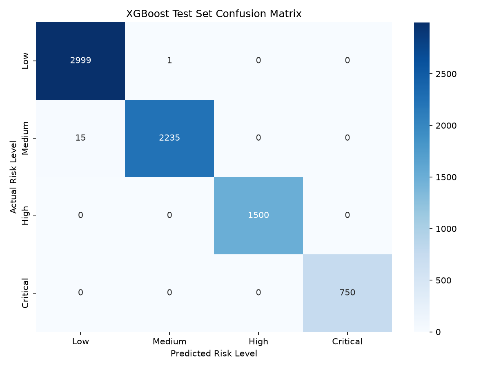
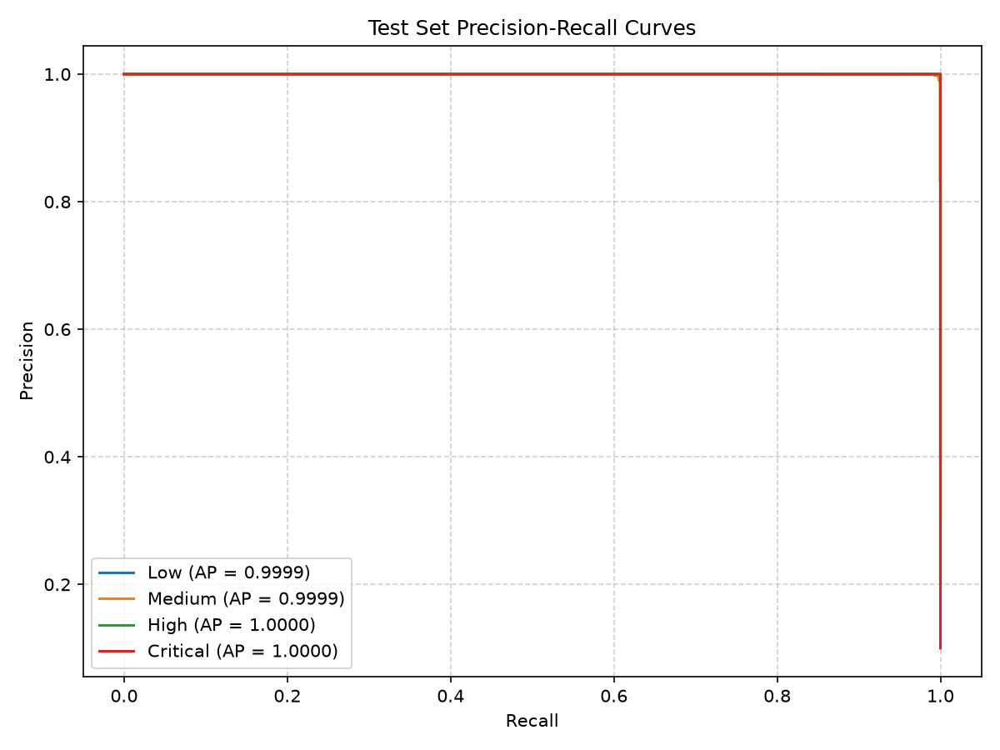
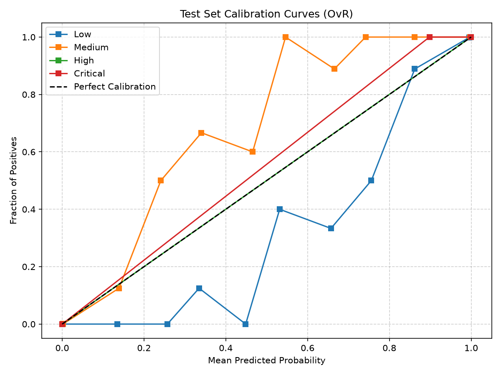
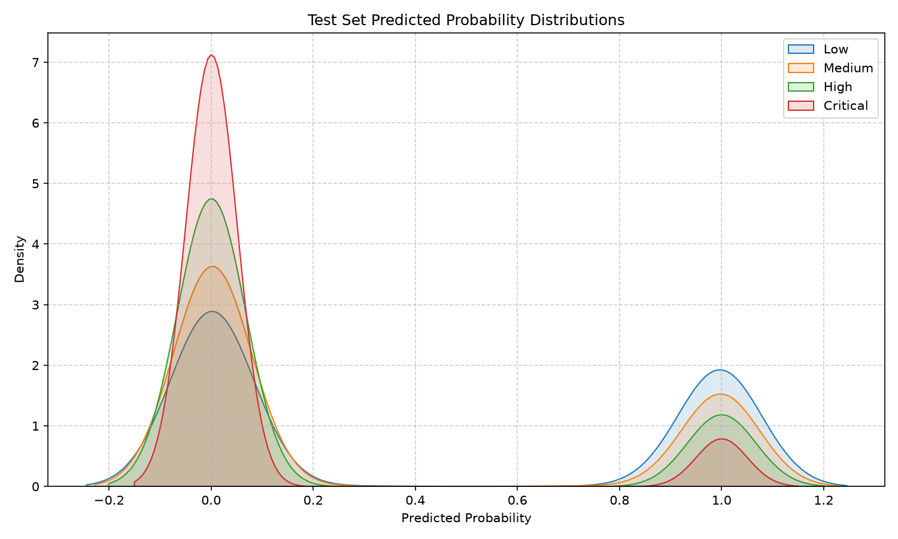
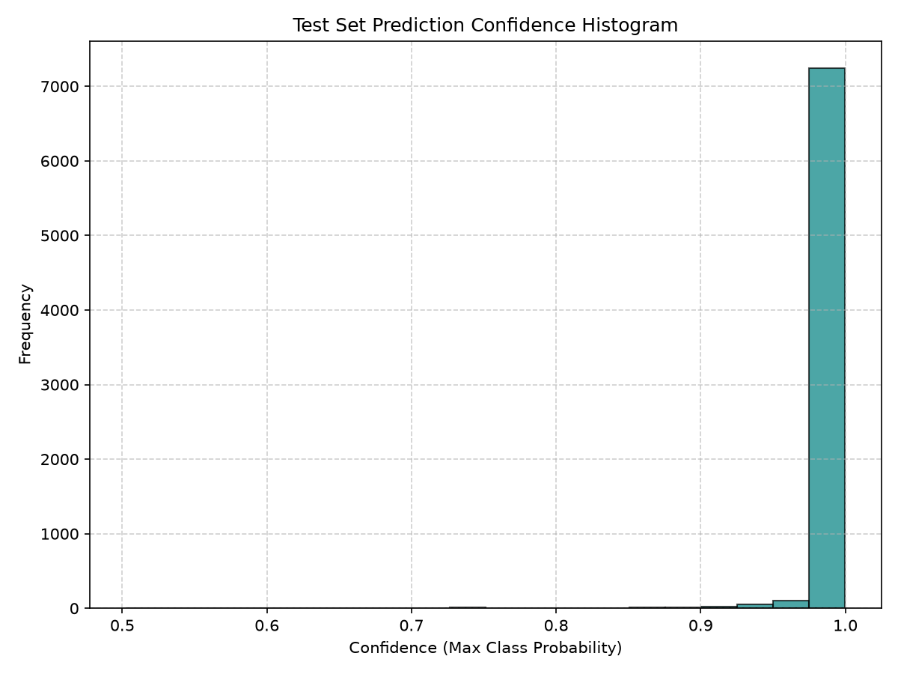

# Test Set Metrics Report

This report summarizes the performance metrics of the trained XGBoost model evaluated exclusively on the **Test Set partition** of the optimal **FeatureSet_B**.

## 1. Classification Performance Overview
- **Test ROC-AUC (One-vs-Rest)**: **0.999976**

### Test Classification Report
```
              precision    recall  f1-score   support

         Low       1.00      1.00      1.00      3000
      Medium       1.00      0.99      1.00      2250
        High       1.00      1.00      1.00      1500
    Critical       1.00      1.00      1.00       750

    accuracy                           1.00      7500
   macro avg       1.00      1.00      1.00      7500
weighted avg       1.00      1.00      1.00      7500

```

### Per-Class Test Metrics Breakdown
| Risk Class | Precision | Recall | F1-Score | Support |
| :--- | :---: | :---: | :---: | :---: |
| **Low** | 0.9950 | 0.9997 | 0.9973 | 3000 |
| **Medium** | 0.9996 | 0.9933 | 0.9964 | 2250 |
| **High** | 1.0000 | 1.0000 | 1.0000 | 1500 |
| **Critical** | 1.0000 | 1.0000 | 1.0000 | 750 |

## 2. Confusion Matrix
| Actual \ Predicted | Low | Medium | High | Critical |
| :--- | :---: | :---: | :---: | :---: |
| **Low** | 2999 | 1 | 0 | 0 |
| **Medium** | 15 | 2235 | 0 | 0 |
| **High** | 0 | 0 | 1500 | 0 |
| **Critical** | 0 | 0 | 0 | 750 |



## 3. Precision–Recall and Calibration Diagnostics
Precision-Recall evaluates model quality under class imbalance. Calibration curves verify if predicted probabilities represent true frequencies.




## 4. Probability and Confidence Distributions
Analyze prediction confidence separation and class probability profiles on unseen test data.




---
**Report generated successfully. No training metrics are included to prevent reporting bias.**