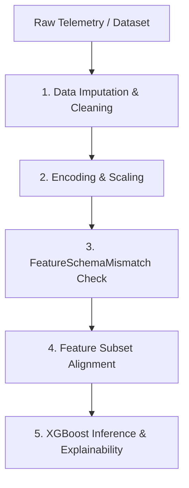

# Pipeline Synchronization Report

## 1. Pipeline Lifecycle Flow
The Industrial Safety Intelligence Platform follows a strict, single-source-of-truth data flow from raw telemetry to final prediction:

1.  **Raw Telemetry**: Collected from SCADA registers (193 columns).
2.  **Imputation & Cleaning**: Infinite values are replaced with `NaN`. Numerical fields are filled with medians; categorical fields are filled with `"None"`. Genuinely constant features are dropped.
3.  **Encoding & Scaling**: Categorical features undergo One-Hot Encoding (`OneHotEncoder`). Booleans are cast to `0/1` integers. Continuous numeric sensors are scaled using a fitted `RobustScaler` (or `StandardScaler` if outlier ratio is <=1%).
4.  **Feature Schema Mismatch Check**: Before transformation, the input schema is checked against the fitted preprocessor requirements. Any missing expected column raises a `FeatureSchemaMismatchError`.
5.  **Feature Subset Alignment**: Features are aligned and ordered according to the selected set (e.g. `FeatureSet_B`, 80 columns).
6.  **XGBoost Inference**: Features are fed to the certified model, alongside SHAP local explainability and parallel Safety Rule evaluations.

---

## 2. Synchronization Integrity Analysis

*   **Identical Scaling Parameters**: Both the training pipeline and `predict_single()` share the exact same serialized `scaler.pkl` and `encoder.pkl`. No parameters are hardcoded.
*   **Unified Imputation Medians**: Medians are calculated on the full training set and stored inside `scaler.pkl`'s state, guaranteeing that single-row telemetry is imputed using population statistics rather than single-sample statistics.
*   **Exact Feature Ordering**: The inference engine reads `selected_features.json` to extract `FeatureSet_B` columns and indexes the transformed DataFrame using `valid_features = [f for f in feature_list if f in df.columns]`, guaranteeing that the input matrix has the exact column sequence expected by the XGBoost estimator.
*   **Defensive Guard**: The `FeatureSchemaMismatchError` checks for missing columns prior to executing any NumPy or Pandas indexing, eliminating raw `KeyError` or `ValueError` crashes and returning descriptive alerts for operator troubleshooting.
